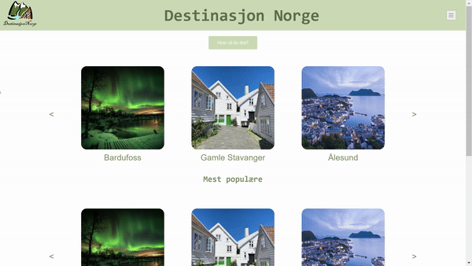

# PU (TDT4140) - Group 2

This repository hosts a group project from **NTNU**, collaboratively developed by 7 students across 3 different fields of study.

## Table of content 📚

- [Installation ⚡](#installation-⚡)
- [Get Started 🔄](#get-started-🔄)
- [Project Members 🧔](#project-members-🧔)
- [Tests 🧪](#tests-🧪)
- [Overview 🔎](#overview-🔎)
- [Diffent Types of Access ⌨️](#diffent-yypes-of-access-⌨️)
- [Technology 👩‍💻](#technology-👩‍💻)
- [Gitlab 👩‍💻](#gitlab-👩‍💻)

## Installation ⚡

1. npm
2. node.js

## Get Started 🔄

1. Install **npm** and **node.js**: https://docs.npmjs.com/downloading-and-installing-node-js-and-npm
2. Clone repository: https://gitlab.stud.idi.ntnu.no/tdt4140-2024/produktomraade-1/gruppe-2/tdt4140_gruppe2
3. Go to repository root-folder (this folder)
4. To install node-modules run: `npm ci`
5. To start frontend: `npm run dev`

## Project Members 🧔

- Anine Løkken -
- Oskar Emil Wavold - oskarew@stud.ntnu.no
- Birk Strand Bjørnaa -
- Brinje Marie Haugli -
- Elise Flovikholm -
- Luka Krstic -
- Sindre Bjerklund Lindberg

## Tests 🧪

To run test [go here](./src/test/readme.md#Tests).

## Overview 🔎

This project is a web platform specifically designed for young Norwegians searching for new destinations within Norway. The main goal is to offer fresh ideas and simplify the process of discovering new places to visit, ensuring the platform is user-friendly and accessible to our target audience.

## Differnt Types of Access ⌨️

### User

Users have the ability to 'like' destinations, which influences the personalized recommendations they receive. This feature make the platfor more relevant for the users persionality.

### Admin

Administrators has acces to more pages then normal user. They have the authority to add new destinations, edit destination and delete destinations. This capability includes uploading images, descriptions, and essential details about each location.

### Other

Individuals who are not logged in still have access to the page. They can browse through destinations but cannot like them or access administrator pages.

## Technology 👩‍💻

- Frontend: **React** with **typescript** and **Vite**
- Database: **Fierbase**
- Tests: **Vitest**

## Gitlab 👩‍💻

### Labels

- **Must Have** is
- **Should Have** is
- **Wont Have** is

### Commits
